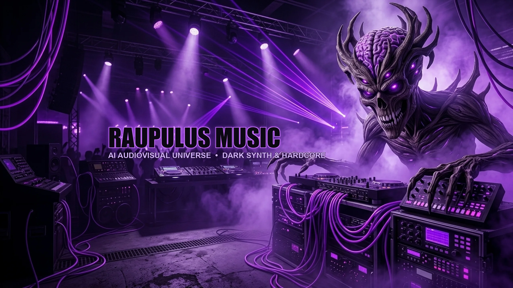
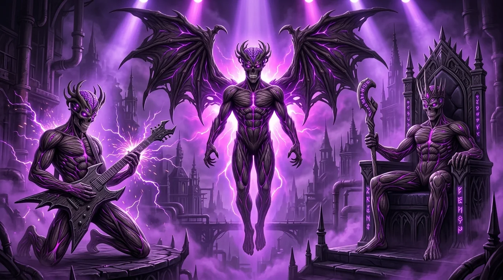
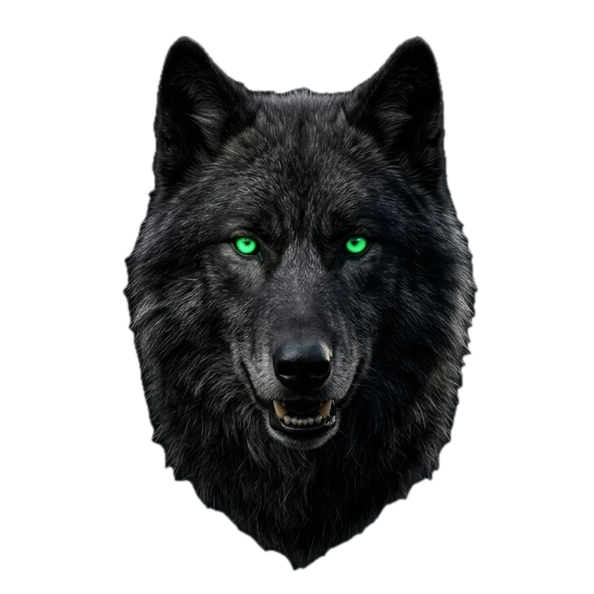
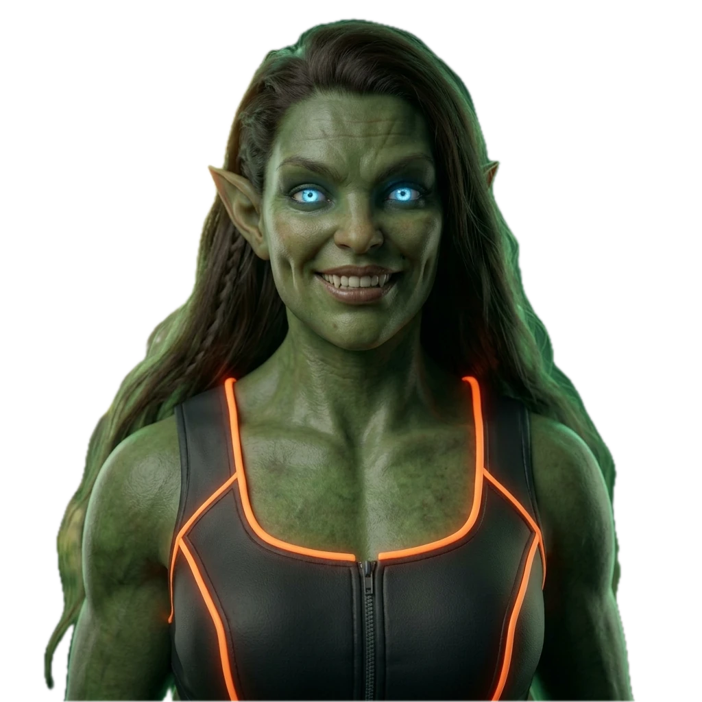
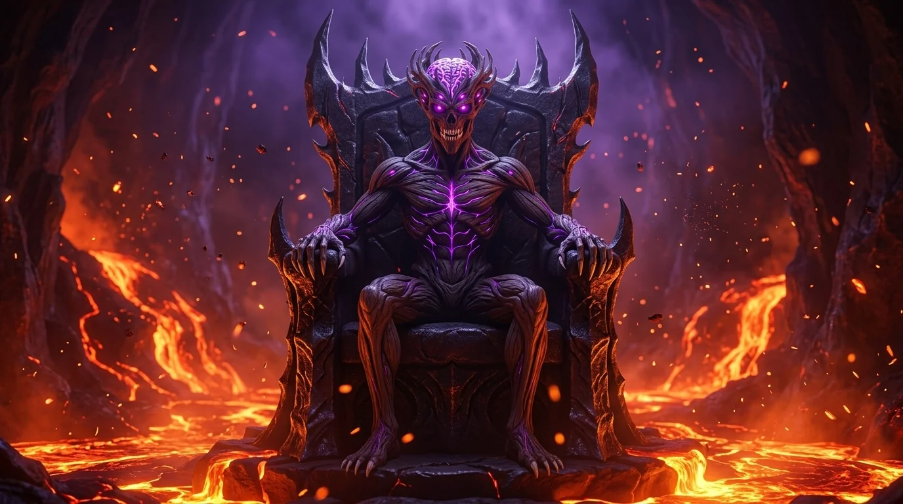
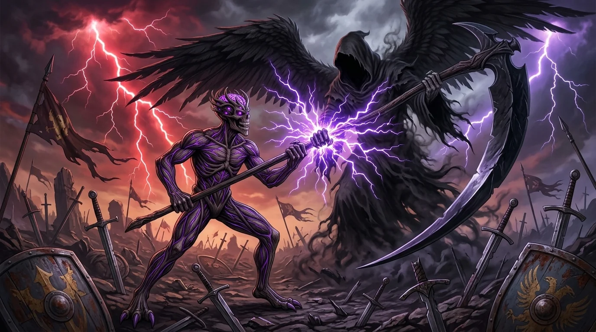
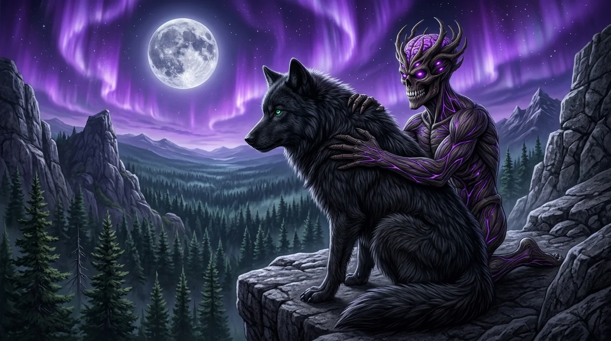
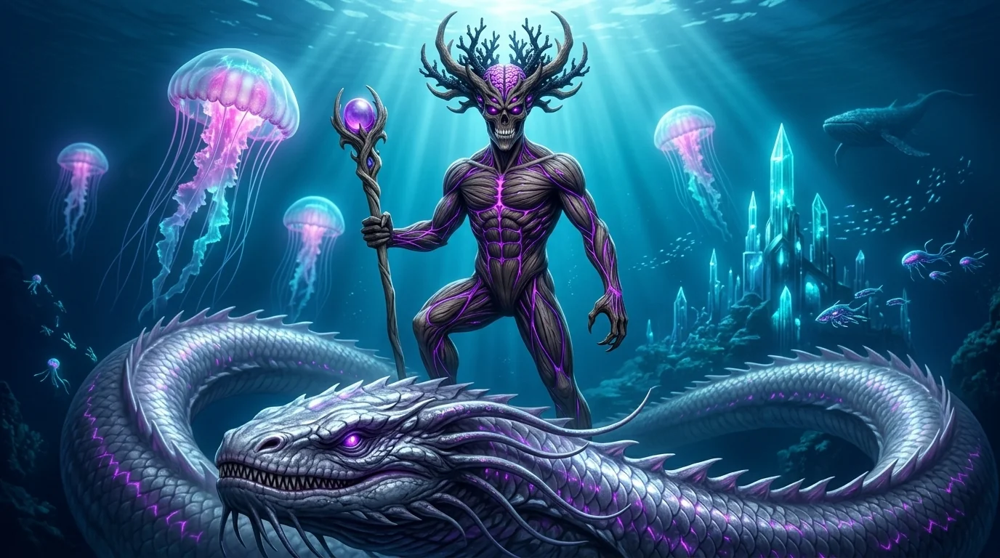
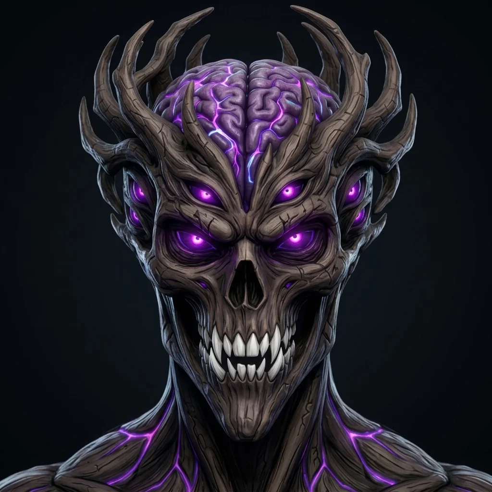

<p align="center">
  <a href="https://music.raupulus.dev" target="_blank" rel="noopener noreferrer">
    
  </a>
</p>

<h1 align="center">RAUPULUS MUSIC</h1>

<p align="center">
  <strong>🔥 Metal Industrial • Cyber Hardcore • Inteligencia Artificial Cinematográfica 🔥</strong><br>
  <em>Álbum Debut: CD 1 — «Nunca venderé mi alma de Metal»</em>
</p>

<p align="center">
  <a href="https://www.youtube.com/@RaupulusMusic" target="_blank">
    
  </a>
  <a href="https://www.youtube.com/@RaupulusMusic?sub_confirmation=1" target="_blank">
    
  </a>
  <a href="https://music.raupulus.dev" target="_blank">
    
  </a>
  <a href="https://www.youtube.com/watch?v=ATeWyiFG-cM&list=PLAfm1RK6VyG8" target="_blank">
    
  </a>
</p>

<p align="center">
  
  
  
  
  
</p>

---

## ⚡ Accesos Rápidos y Conversión Directa

| 🎯 Destino | 🔗 Enlace Directo | ℹ️ Descripción |
| :--- | :--- | :--- |
| 🔴 **Canal Oficial de YouTube** | [**youtube.com/@RaupulusMusic**](https://www.youtube.com/@RaupulusMusic) | Videoclips oficiales cinematográficos en máxima calidad. |
| 🔔 **Suscripción Directa (1 Clic)** | [**Suscribirse a @RaupulusMusic**](https://www.youtube.com/@RaupulusMusic?sub_confirmation=1) | Recibe notificaciones de nuevos lanzamientos y próximos discos. |
| 🌐 **Portal Web Oficial** | [**music.raupulus.dev**](https://music.raupulus.dev) | Catálogo interactivo con reproductor, letras y crónicas completas. |
| 💿 **Reproducir Álbum Completo** | [**Ver Playlist Oficial del CD 1**](https://www.youtube.com/watch?v=ATeWyiFG-cM&list=PLAfm1RK6VyG8) | Reproducción continua de las 23 canciones en YouTube. |

---

## 🎬 Acerca del Proyecto

**Raupulus Music** es una experiencia conceptual multimedia que fusiona la potencia del **Metal Industrial** y el **Cyber Hardcore** con un universo cinematográfico de fantasía oscura y ciencia ficción generado con Inteligencia Artificial.

El disco debut, **«Nunca venderé mi alma de Metal» (CD 1)**, está compuesto por **23 canciones originales** y más de **570 clips cinematográficos** generados a compás exacto (10 segundos por clip), creando un despliegue visual ininterrumpido que narra la resistencia del espíritu frente a la tiranía, la traición y el despojo.

<p align="center">
  <a href="https://music.raupulus.dev" target="_blank" rel="noopener noreferrer">
    
  </a>
  <br>
  <em>Tríptico Oficial: El Riff de la Tormenta, Las Alas de Ébano y El Trono de los Sesenta Mares</em>
</p>

---

## 🌌 Personajes del Universo Cinematográfico

El universo visual y narrativo de Raupulus cobra vida a través de tres figuras clave en constante interacción y evolución dramática:

<div align="center">
  <table>
    <tr>
      <td align="center" width="33%" valign="top">
        <a href="https://music.raupulus.dev#lore" target="_blank" rel="noopener noreferrer">
          
        </a>
        <br><br>
        <strong>RAUPULUS</strong><br>
        <em>El Soberano Indomable</em>
        <p align="left"><small>Entidad bio-orgánica forjada en haces musculares de madera de ébano, ocho ojos bioluminiscentes sin pupilas, corona de cuernos curvados y energía neural violeta pulsante en su coronilla.</small></p>
      </td>
      <td align="center" width="33%" valign="top">
        <a href="https://music.raupulus.dev#lore" target="_blank" rel="noopener noreferrer">
          
        </a>
        <br><br>
        <strong>SU MEJOR AMIGO</strong><br>
        <em>El Lobo Titánico</em>
        <p align="left"><small>Colosal lobo huargo de pelaje azabache y dos faros verde esmeralda por ojos. Guardián leal, hermano de batalla y el compañero incondicional que rescata a Raupulus de la soledad.</small></p>
      </td>
      <td align="center" width="33%" valign="top">
        <a href="https://music.raupulus.dev#lore" target="_blank" rel="noopener noreferrer">
          
        </a>
        <br><br>
        <strong>AMADA</strong><br>
        <em>La Musa Trágica</em>
        <p align="left"><small>Guerrera y espíritu de estirpe elfa-ogra híbrida. Su belleza salvaje, memoria y destino efímero impulsan la rebelión de Raupulus contra el paso implacable del tiempo.</small></p>
      </td>
    </tr>
  </table>
</div>

---

## 🎥 Videoclips Destacados (Galería 16:9)

Una muestra visual de la ambientación cinematográfica generada clip a clip para el álbum:

<div align="center">
  <table>
    <tr>
      <td align="center" width="25%" valign="top">
        <a href="https://www.youtube.com/watch?v=PyvTqcnsZgI" target="_blank" rel="noopener noreferrer">
          <br>
          <strong>#01 Corona de Hierro</strong><br>
          <small>🔥 Fortaleza Volcánica</small><br>
          <small>▶️ <em>Ver en YouTube</em></small>
        </a>
      </td>
      <td align="center" width="25%" valign="top">
        <a href="https://www.youtube.com/watch?v=DBfvozBREXg" target="_blank" rel="noopener noreferrer">
          <br>
          <strong>#08 Pacto con la Muerte</strong><br>
          <small>💀 Trono de las Ánimas</small><br>
          <small>▶️ <em>Ver en YouTube</em></small>
        </a>
      </td>
      <td align="center" width="25%" valign="top">
        <a href="https://www.youtube.com/watch?v=mp5wRq_PS8U" target="_blank" rel="noopener noreferrer">
          <br>
          <strong>#10 Mi mejor amigo Ladra</strong><br>
          <small>🐺 Lealtad Inquebrantable</small><br>
          <small>▶️ <em>Ver en YouTube</em></small>
        </a>
      </td>
      <td align="center" width="25%" valign="top">
        <a href="https://www.youtube.com/watch?v=yHHLgW3XuQg" target="_blank" rel="noopener noreferrer">
          <br>
          <strong>#19 Rey de los 60 Mares</strong><br>
          <small>⚡ Bastón y Mareas</small><br>
          <small>▶️ <em>Ver en YouTube</em></small>
        </a>
      </td>
    </tr>
  </table>
</div>

---

## 📜 Repertorio Completo del Álbum (23 Canciones)

Haz clic en **«Ver Videoclip»** para abrir el vídeo oficial en YouTube o en **«Letra & Crónica»** para acceder a la ficha oficial con la letra sincronizada y la crónica detallada del storyboard:

| # | Título | Duración | Clips (10s) | 🎬 YouTube | 📖 Web Oficial |
| :-: | :--- | :-: | :-: | :--- | :--- |
| **01** | **Corona de Hierro** | 03:31 | 21 clips | [▶️ Ver Videoclip](https://www.youtube.com/watch?v=PyvTqcnsZgI) | [📜 Letra & Crónica](https://music.raupulus.dev/canciones/01-corona-de-hierro.html) |
| **02** | **Desde el cielo Mando** | 03:42 | 23 clips | [▶️ Ver Videoclip](https://www.youtube.com/watch?v=StCK6oO_JPM) | [📜 Letra & Crónica](https://music.raupulus.dev/canciones/02-desde-el-cielo-mando.html) |
| **03** | **Me has robado la vida** | 04:13 | 26 clips | [▶️ Ver Videoclip](https://www.youtube.com/watch?v=oZEK5_YWW4c) | [📜 Letra & Crónica](https://music.raupulus.dev/canciones/03-me-has-robado-la-vida.html) |
| **04** | **Bandolero de la Noche** | 04:04 | 25 clips | [▶️ Ver Videoclip](https://www.youtube.com/watch?v=zZB-H_TxBqE) | [📜 Letra & Crónica](https://music.raupulus.dev/canciones/04-bandolero-de-la-noche.html) |
| **05** | **No vuelvo a Respirar** | 04:09 | 25 clips | [▶️ Ver Videoclip](https://www.youtube.com/watch?v=AZMI5Kqgi10) | [📜 Letra & Crónica](https://music.raupulus.dev/canciones/05-no-vuelvo-a-respirar.html) |
| **06** | **Ciudadano de un país llamado Métal** | 03:37 | 22 clips | [▶️ Ver Videoclip](https://www.youtube.com/watch?v=Kb1YxcttScc) | [📜 Letra & Crónica](https://music.raupulus.dev/canciones/06-ciudadano-de-un-pais-llamado-metal.html) |
| **07** | **Mi corazón bombea Ginebra** | 03:59 | 24 clips | [▶️ Ver Videoclip](https://www.youtube.com/watch?v=xC0Y0rx-5lU) | [📜 Letra & Crónica](https://music.raupulus.dev/canciones/07-mi-corazon-bombea-ginebra.html) |
| **08** | **Pacto con la Muerte** | 04:07 | 25 clips | [▶️ Ver Videoclip](https://www.youtube.com/watch?v=DBfvozBREXg) | [📜 Letra & Crónica](https://music.raupulus.dev/canciones/08-pacto-con-la-muerte.html) |
| **09** | **Derrapando por tu Piel** | 03:52 | 24 clips | [▶️ Ver Videoclip](https://www.youtube.com/watch?v=u40CotMrAJo) | [📜 Letra & Crónica](https://music.raupulus.dev/canciones/09-derrapando-por-tu-piel.html) |
| **10** | **Mi mejor amigo Ladra** | 03:32 | 22 clips | [▶️ Ver Videoclip](https://www.youtube.com/watch?v=mp5wRq_PS8U) | [📜 Letra & Crónica](https://music.raupulus.dev/canciones/10-mi-mejor-amigo-ladra.html) |
| **11** | **Vivo en la carretera** | 04:24 | 27 clips | [▶️ Ver Videoclip](https://www.youtube.com/watch?v=JPS26YoNJ7w) | [📜 Letra & Crónica](https://music.raupulus.dev/canciones/11-vivo-en-la-carretera.html) |
| **12** | **Trillado del Coco** | 04:13 | 26 clips | [▶️ Ver Videoclip](https://www.youtube.com/watch?v=ZcBROzcaf80) | [📜 Letra & Crónica](https://music.raupulus.dev/canciones/12-trillado-del-coco.html) |
| **13** | **Ya no me quedan amigos** | 05:02 | 31 clips | [▶️ Ver Videoclip](https://www.youtube.com/watch?v=-oJfBCCCeHM) | [📜 Letra & Crónica](https://music.raupulus.dev/canciones/13-ya-no-me-quedan-amigos.html) |
| **14** | **Diez Mil Años en más de 100 vidas** | 03:24 | 21 clips | [▶️ Ver Videoclip](https://www.youtube.com/watch?v=8x2uwLAnXlQ) | [📜 Letra & Crónica](https://music.raupulus.dev/canciones/14-diez-mil-anos-en-mas-de-100-vidas.html) |
| **15** | **No quedan árboles en mi Barrio** | 04:14 | 26 clips | [▶️ Ver Videoclip](https://www.youtube.com/watch?v=eaGRqNsznZg) | [📜 Letra & Crónica](https://music.raupulus.dev/canciones/15-no-quedan-arboles-en-mi-barrio.html) |
| **16** | **Ángel Rechazado** | 04:03 | 25 clips | [▶️ Ver Videoclip](https://www.youtube.com/watch?v=koQzQXeP0h8) | [📜 Letra & Crónica](https://music.raupulus.dev/canciones/16-angel-rechazado.html) |
| **17** | **He perdido el hambre** | 03:47 | 23 clips | [▶️ Ver Videoclip](https://www.youtube.com/watch?v=mwQDAXvQSTE) | [📜 Letra & Crónica](https://music.raupulus.dev/canciones/17-he-perdido-el-hambre.html) |
| **18** | **Mi amada tiene fecha de caducidad** | 04:17 | 26 clips | [▶️ Ver Videoclip](https://www.youtube.com/watch?v=SnTkN2MmqcY) | [📜 Letra & Crónica](https://music.raupulus.dev/canciones/18-mi-amada-tiene-fecha-de-caducidad.html) |
| **19** | **Rey de los Sesenta Mares** | 04:07 | 25 clips | [▶️ Ver Videoclip](https://www.youtube.com/watch?v=yHHLgW3XuQg) | [📜 Letra & Crónica](https://music.raupulus.dev/canciones/19-rey-de-los-sesenta-mares.html) |
| **20** | **Soy Rico sin tener Dinero** | 04:04 | 25 clips | [▶️ Ver Videoclip](https://www.youtube.com/watch?v=ATeWyiFG-cM) | [📜 Letra & Crónica](https://music.raupulus.dev/canciones/20-soy-rico-sin-tener-dinero.html) |
| **21** | **Grito a la Montaña** | 04:05 | 25 clips | [🔴 Estreno en YouTube](https://www.youtube.com/@RaupulusMusic) | [📜 Letra & Crónica](https://music.raupulus.dev/canciones/21-grito-a-la-montana.html) |
| **22** | **Mil veces me dijeron que no podía** | 04:04 | 25 clips | [🔴 Estreno en YouTube](https://www.youtube.com/@RaupulusMusic) | [📜 Letra & Crónica](https://music.raupulus.dev/canciones/22-mil-veces-me-dijeron-que-no-podia.html) |
| **23** | **Por encima de los límites** | 04:19 | 26 clips | [🔴 Estreno en YouTube](https://www.youtube.com/@RaupulusMusic) | [📜 Letra & Crónica](https://music.raupulus.dev/canciones/23-por-encima-de-los-limites.html) |

---

## 🛠️ Arquitectura Web y Compilación

<p align="center">
  <a href="https://music.raupulus.dev" target="_blank" rel="noopener noreferrer">
    
  </a>
  <br>
  <em>Diseño temático oscuro y bioluminiscente optimizado para Core Web Vitals y conversión directa</em>
</p>

La web oficial ([music.raupulus.dev](https://music.raupulus.dev)) está construida con un generador estático en Python (`build.py`), diseñado para máxima velocidad de carga, SEO optimizado y Core Web Vitals impecables sin dependencias externas pesadas ni frameworks sobrecargados.

```text
web/
├── AGENTS.md                 # Reglas del proyecto, privacidad y estándares de diseño
├── README.md                 # Portada del repositorio y catálogo oficial
├── build.py                  # Generador estático Python (compila dist/ en < 1 segundo)
├── serve.py                  # Servidor local de desarrollo (http://localhost:8080)
├── data/
│   └── songs.json            # Base de datos con las 23 canciones, letras, crónicas e IDs
├── src/
│   ├── css/
│   │   ├── common.css        # Variables, reset, accesibilidad, navbar y footer
│   │   ├── home.css          # Hero, single destacado, rejilla de canciones y modal
│   │   ├── song.css          # Ficha técnica, letra oficial y crónica narrativa
│   │   └── style.css         # Hoja compilada unificada
│   └── js/
│       ├── main.js           # Modal de previsualización rápida, buscador en vivo y utilidades
│       └── alpine.min.js     # Alpine.js vendored localmente
└── dist/                     # 🚀 Sitio estático compilado 100% listo para producción
    ├── index.html            # Portada principal con buscador, modal y reproductor
    ├── canciones/            # 23 páginas estáticas dedicadas
    ├── assets/               # CSS modular minificado, JS e imágenes
    ├── sitemap.xml           # Sitemap oficial para Google Search Console
    └── robots.txt            # Reglas de indexación SEO
```

### 💻 Cómo Compilar y Probar en Local

1. **Compilar el sitio:**
   ```bash
   python3 build.py
   ```
2. **Iniciar servidor local para probar con reproductores de YouTube activos:**
   ```bash
   python3 serve.py
   ```
   *Abre automáticamente `http://localhost:8080` con soporte para políticas de origen `Referrer` de Google.*

3. **Despliegue (Deploy):**
   El directorio `dist/` es 100% estático y puede desplegarse directamente en **Cloudflare Pages**, **Vercel**, **Netlify**, **GitHub Pages** o servidores tradicionales (**Nginx / Apache**).

---

## 🔒 Privacidad, Autoría y Contacto

<p align="center">
  <a href="https://music.raupulus.dev" target="_blank">
    
  </a>
</p>

* **Música, Guion y Dirección:** Raupulus
* **Creador:** **Raúl Caro Pastorino (@raupulus)**
* **Canal Oficial de Música:** [@RaupulusMusic](https://www.youtube.com/@RaupulusMusic)
* **Canal Personal & Tech:** [@raupulus](https://www.youtube.com/@raupulus)
* **Contacto Oficial:** [public@raupulus.dev](mailto:public@raupulus.dev)
* **Copyright:** © 2026 **Raupulus Music**. Letras, composiciones musicales y obras visuales registradas. Todos los derechos reservados.

<p align="center">
  <strong>⚔️ «NUNCA VENDERÉ MI ALMA DE METAL» ⚔️</strong><br>
  <a href="https://www.youtube.com/@RaupulusMusic?sub_confirmation=1">👉 ¡Haz clic aquí para suscribirte al canal oficial de YouTube! 👈</a>
</p>
